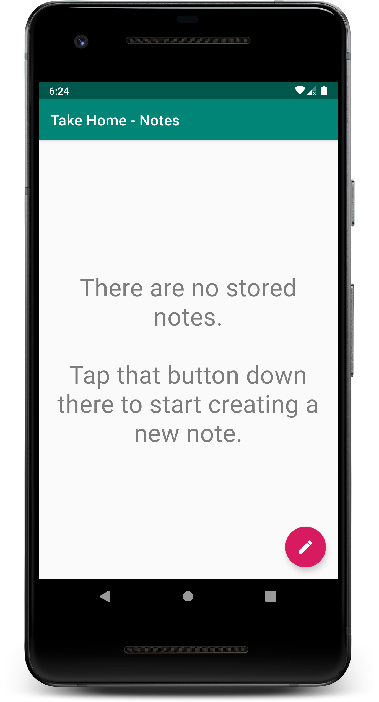
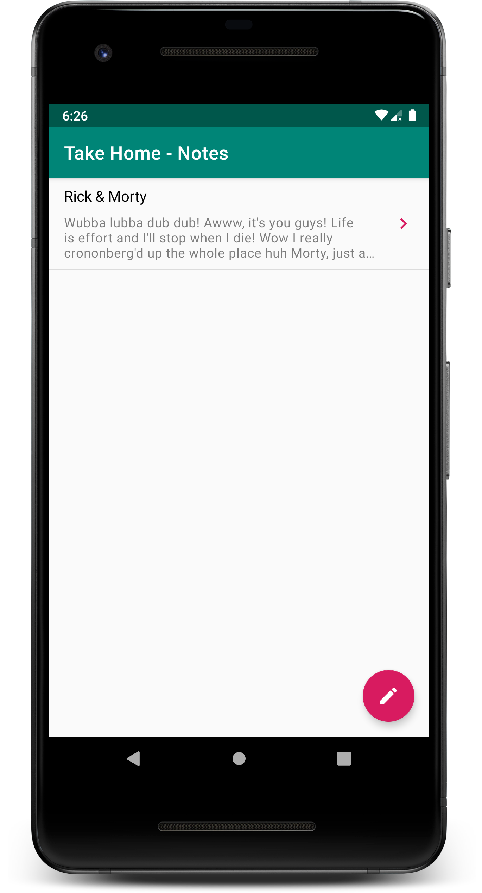
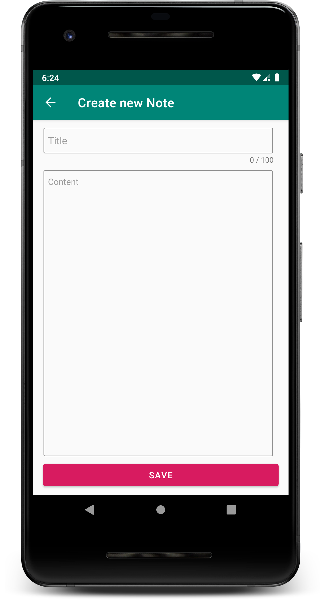
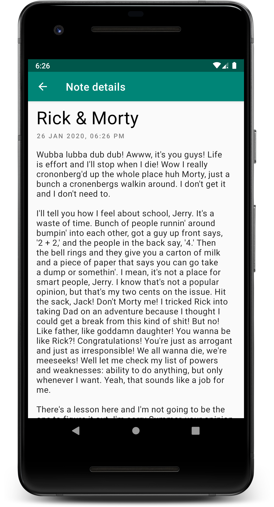

# Take Home - Notes

This application is created as part of a take-home assignment for a company. Spec document can be found [here](./Take Home Exercise - Note taking app.pdf)

## Running the application

To build the debug-variant of application, use the below command

```shell
# On Linux/Unix system
./gradlew assembleDebug

# On Windows system
gradlew.bat assembleDebug
```

You can then find the generated apk file at `<project-dir>/app/build/outputs/apk/debug/app-debug.apk`

**Note:** I have already built and put an apk for the same [here](./generate-apk/Take Home - Notes (debug).apk). You can directly install it on your device to test.

## Running the tests

To run the unit-tests, use the below command

```shell
# On Linux/Unix system
./gradlew test

# On Windows system
gradlew.bat test
```

After it finishes, you can find the results of the test in this directory: `<project-dir>/app/build/reports/test/testReleaseUnitTest`

## Screenshots








